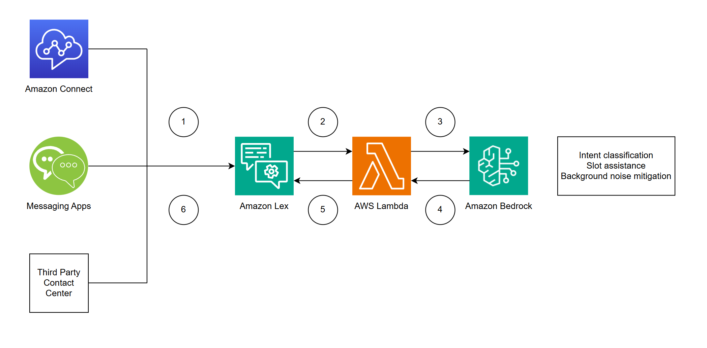

# Enhance your customer's omnichannel experience with Amazon Bedrock and Amazon Lex

[Amazon Lex](https://aws.amazon.com/lex/) enables organizations to create conversational AI interfaces that enhances customer experience across all channels for any application. At its core, Lex combines two AI technologies - Natural Language Understanding (NLU) to grasp user intent and Automatic Speech Recognition (ASR) to convert speech into text. This combination allows Lex to take natural language speech and text input, understand the intent behind given input, and fulfill the user intent by invoking the appropriate response. Using Lex, organizations can lower operational costs through reduced agent handle times, improve customer satisfaction with minimal customer holds, and efficient routing of requests between self-service options and human support channels based on task complexity.

With the advent of generative AI and Large Language Models (LLMs), the potential to enhance the customer experience further expands, opening new possibilities for more flexible and sophisticated customer interactions. This is where the integration of Amazon Lex and Amazon Bedrock becomes invaluable. [Amazon Bedrock](https://aws.amazon.com/bedrock/) is a fully managed service that offers a choice of high-performing foundation models along with a broad set of capabilites you need to build generative AI applications.

One way to integrate Lex and Bedrock is to let Lex serve as the initial touchpoint that manages intent identification, slot collection, and fulfillment and have Bedrock act as a secondary validation layer that intervenes only when Lex encounters uncertainties in understanding customer inputs. The following are three scenarios how this setup enhances customer interactions:

- **Intent identification**: Traditional NLU models struggle with out-of-band customer responses that don't match their training data. LLMs can better understand these responses by leveraging context and intent descriptions to accurately classify customer needs.

- **Assisted slot resolution for custom slots**: When customers provide non-standard responses for custom slot types in Amazon Lex, additional logic is needed to interpret these inputs. LLMs can help by mapping varied customer responses to appropriate slot values, like interpreting "the whole dang top of my house is gone" as "roof" or "Toyota Tundra" as "truck".

- **Background noise mitigation**: Background noise and irrelevant audio can confuse traditional NLU models when transcribed alongside customer speech. LLMs can filter out irrelevant transcribed content and focus on mapping customer's utterance to intent or slot defined for Lex bot.

This example demonstrates a Lex bot integrated with foundation models hosted on Bedrock that gathers First Notice of Loss (FNOL) information from users who want to file insurance claims.

## Solution Overview

The workflow consists of the following steps:

1. Messages are sent to Amazon Lex from multiple channels (e.g., Amazon Connect, messaging apps, and third-party contact centers). Amazon Lex NLU maps user utterances to specific intents.

2. The Lambda function is invoked at certain phases of the conversation where Amazon Lex NLU didn’t identity the user utterance, such as during the fallback intent or during slot fulfillment.

3. Lambda calls foundation models through Amazon Bedrock to identify the intent, identify the slot, or mitigate the transcribed messages from background noise.

4. Amazon Bedrock returns the identified intent or slot, or responds that it is unable to classify the utterance as one of the defined intents or slots.

5. Lambda sets the state of Amazon Lex to either move forward in the selected intent or re-prompt the user for input.

6. Amazon Lex continues the conversation by either continuing to fulfill the intent or re-prompting the user.

## Prerequisites

- An AWS account with privileges to create [AWS Identity and Access Management](https://aws.amazon.com/iam/) (IAM) roles and policies.

- Access enabled for your model of choice on Amazon Bedrock. For instructions, see [Access Amazon Bedrock foundation models](https://docs.aws.amazon.com/bedrock/latest/userguide/model-access.html).

## Deployment

| `us-east-1` |  |
| :---------: | :------------------------------------------------------------------------------------------------------------------------------------------------------------------------------------------------------------------------------------------: |

1. Press **Launch Stack** to launch a CloudFormation stack in the `us-east-1` Region.

2. For **Stack name**, enter a name for your stack.

3. For **ModelName**, select your model of choice.

4. Review the IAM resource creation for the CloudFormation template and press **Create stack**.

## Interacting with omnichannel bot

To interact with the bot, navigate to FNOLBot on the Amazon Lex console and open a test window. Refer to below screenshots for step-by-step guide.

Now, we can test the solution from the test window. The following screenshots display an example for each of the scenario mentioned previously.

### Intent identification

Note that the Lex bot identifies intent as `GatherFNOLInfo` even when the provided utterance differs substantially from the intent's sample utterances.

### Assisted slot resolution for custom slots

Note that the Lex bot correctly identifies all slot values as `roof` and `concussion`, even though the provided utterances differs substantially from the slot values.

### Background noise mitigation

Note that the Lex bot correctly identifies intent and all slot values, even though the provide utterances include inputs from background noises.

## Cleanup

To avoid incurring future charges, delete the CloudFormation stack when you are finished.

## Conclusion

In this example, we demonstrated how to set up Amazon Lex and Amazon Bedrock for an omnichannel chatbot experience with validation layer. This enables the chatbot to collect intent and slot from potentially out-of-band responses provided by end users without having to re-prompt, allowing for more seamless customer experiences. As seen from examples, if user provides utterance that are outside of bot's NLU training data, the LLM is able to step in and correctly identify the user's intent and slot for Lex bot.

If you have an existing Amazon Lex bot deployed, you can edit the code and prompts attached to Lambda function to enhance the bot for your specific use cases. Try it out and let us know if you have any questions or suggestions!

## Security

See [CONTRIBUTING](CONTRIBUTING.md#security-issue-notifications) for more information.

## License

This library is licensed under the MIT-0 License. See the LICENSE file.
